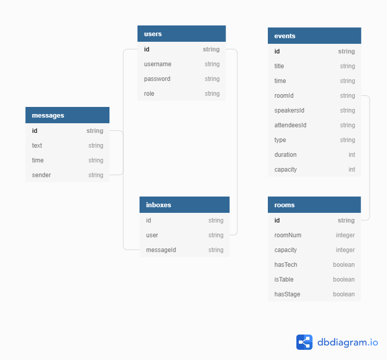

# Event Registration App

INTRODUCTION
------------

About The Project: \
This project allows people login in as origanizer or attendee to communicate with each 
other in specific way. Basing off different type of user, users are able to sign up, cancel, schedule, manage their events and meet with speakers in conference and so on. After program finishing run, the information will be stored outside of the program in some .csc files.

This repo contains code, test, library of CSC207 project. This project was created by group_074: David Zijian Zhao, Haoze Huang, Leyi Wang, Ruoming Ren, Songchen Yuan, Yile Xie, Yi Tao Li, and Zewen Ma by alphabetical order.

The following link contains our design of CRC cards and instructions of phase 1 and phase 2.

- [CRC Cards](https://docs.google.com/spreadsheets/d/1l-SYLEj1_Ms2hQXLZLau1G9BD_9kIWQR5ZxChHeDaMY/edit#gid=1740146710)
- [Phase 1 Spec](https://q.utoronto.ca/courses/180703/pages/project-phase-1)
- [Phase 2 Spec](https://q.utoronto.ca/courses/180703/pages/project-phase-2)

Getting Started
------------

**Pre-requisites**

* JDK 8 or above
* [opencsv v5.3](http://opencsv.sourceforge.net/)
* [sqlite-jdbc v3.32](https://github.com/xerial/sqlite-jdbc)

**Running the Application**

Run the main() method of main.controllers.main

**After Startup**

After starting the program, you will be faced with two options:
1. Login - Choose this option to login using an existing account
2. Register - Choose this option to create a new account

**Usage**

After logging in, you will be given a screen with a number of options depending on your user type. These are where
you will be able to register for events, send messages, and check your messages. Organizers will have the additional 
capability to manage users, manage events and rooms, and save the data in the application.

**Data Management**

The program will automatically save data to `src/store/app.db`, an SQLite DB file, on exit. The program will 
also automatically load data from previous sessions from the same file.

Features Added in Phase 2
------------

**Mandatory Features**

 * An `Admin` user can be created.
 * `Events` can be canceled by at least one `Organizer`.
 * There are now no-speaker events, one-speaker events, and multi-speaker events.
 * `Organizers` can also create `Speaker` accounts, `Attendee` accounts(but not `Admin` accounts).
 * `Admins` can create accounts of all types.
 * Each `Event` has a maximum number of people who can attend it. This amount can be set 
   when the `Event` is created and also changed later, by an `Organizer`.

**Optional Features**

 * Ability to maintain data across sessions using an SQLite database.
 * A Graphic User Interface implemented using java.swing.
 * Add additional constraints to the scheduling for various types of events (e.g. technology requirements for 
   presentations, tables vs rows of chairs).
 * The schedule of the conference can be exported as an HTML file. This optional feature
   is a replacement of the "Create Your Own Feature" part of the Phase 2 specification.
 * User names can only be e-mails. This is achieved by matching with a regex in the registration/login process.

Design Patterns Used
------------

**Bridge**

The Bridge design pattern was used in our Gateway design to make it simple to extend to different data formats.

The interface: Gateway

The implementations: CSVGateway, SQLiteGateway

Implementing an alternate gateway destination would not affect other classes.

**Singleton**

We used the Singleton design pattern to ensure a consistent and single state within the application. Examples include 
our ProgramController, UsersManager, EventsManager, InboxManager, etc. (see ProgramController's constructor for more) 
where only a single instance is instantiated and *injected* into other classes.

**Builder**

We used builder for event in the use case (EventBuilder class) since there are multiple parameter for the event constructor 
and builder pattern can help with construction of this kind of object from its representation so that the 
same construction process can create a simpler representation of initializing an event.

**Simple Factory**

We used the Factory design pattern for the creation of new users and events as they both have multiple subtypes.

For events, we used the Factory design pattern in the EventFactory class since there are different types of events that may be constructed. 
Instead of using different classes to construct different types of events, a factory for event can 
decide which type of object it is creating.

For users, we implemented UserFactory which is a Factory method for adding new user by UsersManager. 
Since we are having four different type of users, organizer, attendee, speaker and admin under user entity class, 
if we want to add a new user type in the future that may extend user class. We just need to make some change 
in UserFactory instead of UsersManager so that it improves the extensibility for future types of users.

**Observer**  
We used the observer pattern in GUI related classes.  
The user interfaces are `observable` classes: they store button listeners(interfaces) to "listen" to any actions done to the buttons and notify the corresponding observer.

The presenters(in the MVP model) are `observers`: they implement the button listeners, decide what to do when a user clicks on a particular button and respond when it is notified by the observable class(a button is clicked).

Improvements in Design Since Phase 1
------------

We combined the subclass of users (Attendee, Organizer, Speaker, and later Admin) into a User class. The four subtypes of user do not differ
in functionality at the Entity level. Therefore, we recognized that there was no need to use inheritance for users. This decision has helped us to
remove redundant code and avoid unnecessary complexity in our program.

## MVP Model

- (Model)The model is the program controller which determines the state of the program(contents in the database).
- (View)The view contains all the UI classes which are seen by clients.
- (Presenter)The UI presenter classes determine what to do based on user inputs and update the view accordingly. It serves as a bridge between view and model.
- Observer pattern is used in the view and the presenter(see [Design Patterns Used](#design-patterns-used))
- Adhering the dependency inversion principle, the presenter classes do not depend on the UI classes. So, each UI implements a UI interface which is stored in the corresponding presenter; when the presenter needs to update the UI, it will call the methods in the UI interface.

Contributors
------------

Github id     | Names 
------------- | -------------
oliphant0803  | Haoze Huang 
YvetteXie     | Yile Xie 
Hiraethwly    | Leyi Wang 
Luke9248      | Ruoming Ren 
kaka0905      | Zewen Ma 
bravetheheat  | David Zhao 
vesteny77 |  Steven Yuan  
Jimmy         | Yi Tao Li 

Contribution Guideline
------------

In general, our project follow the "fork-and-pull" Git workflow.

Each of use fork the repo on GitHub and clone the project to our own machine; then we commit change to our own 
branch and commit changes to our own branch. By submitting a pull request, we merge our branch to main.

TA can check out the pull requests, addition and the java doc of each class that demonstrates the author 
who writes this class. 

SQL Table Schema
------------

Some parts of the schema represent serialized versions of arrays. E.g. events.speakersId. While the data format is 
a string, it represents a list of Speaker IDs

UML Diagram
------------

Model Layer

View Layer (No Connections)

Presenter Layer (No Connections)

[Model-View-Presenter Relationships](./docs/model-view-presenter-relationships.pdf)

 

